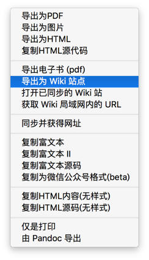
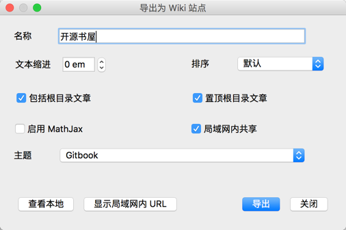
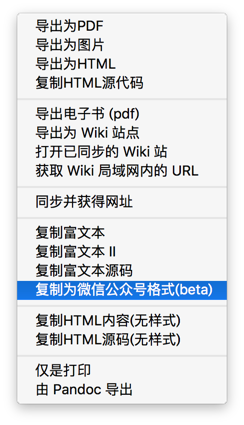

有些目标, 一个人坚持, 可能有点困难; 如果是一群人, 也许会变得容易一些!

## 编辑文章

申请 GitHub 账号, 加入"十六进制科技 (hex-tech)"组织, 克隆博客项目 `blog_src` 到本地.

```
git clone git@github.com:hex-tech/blog_src.git
```

用 Markdown 语法自由编辑, 然后提交.

## 发布文章

发布文章使用 MarkEditor Pro 版.

首先使用**导出 Wiki 站点**功能, 将生产的 `_book` 目录下的 `asset` 和 `*.html` 移动到 `blog` 项目 的 `gh-pages` 分支上, 然后提交.



选择 *Gitbook* 主题



接着使用**复制为微信公众号格式**, 将粘贴板的内容, 粘到微信编辑器中.



在*原文链接*中, 填写 GitHub 上发布的 GitHub Page 页面链接

## 注意事项
